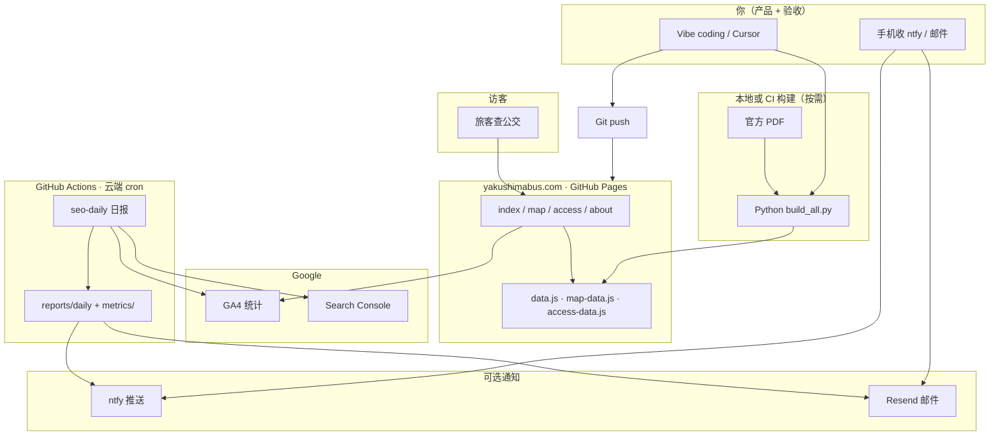

# 架构一览

## 用一张图看懂



---

## 为什么选「纯静态」

| 选项 | 优点 | 缺点 | 本项目 |
|------|------|------|--------|
| **纯静态** | 免费托管、快、几乎无运维 | 不能服务端算逻辑 | ✅ 选用 |
| WordPress | 插件多 | 要服务器、安全更新 | ❌ |
| Next.js + 数据库 | 功能强 | 贵、复杂 | ❌ 杀鸡用牛刀 |

时刻表数据**几天才变一次**，用脚本离线生成 JS 文件足够；查询全在浏览器里完成。

---

## 目录结构（只记这些）

```text
index.html / map/ / access/ / about/   ← 页面
data.js, map-data.js, access-data.js   ← 运行时读的数据（生成物）
sources/manifest.json                  ← 官方 PDF 链接清单
sources/overrides/                     ← 手工小改
scripts/build_all.py                   ← 一键重建数据
assets/pdf/                            ← 本地 PDF 副本
.github/workflows/seo-*.yml            ← 定时 SEO 任务
docs/playbook/                         ← 本 playbook
docs/seo/                              ← SEO 教程与报告存档
secrets/                               ← 本地密钥（gitignore，勿提交）
```

---

## 页面与数据对应

| URL | 用途 | 数据文件 |
|-----|------|----------|
| `/` | 时刻表查询 | `data.js` |
| `/map/` | 路线图 + 运价 | `map-data.js` |
| `/access/` | 上岛船/巴士 | `access-data.js` |
| `/about/` | 关于与联系 | `about-data.js` |

**Clean URL**：`map.html` 与 `map/index.html` 并存，便于 SEO；`sitemap.xml` 列出规范 URL。

---

## SEO / 分析层（叠在静态站上面）

| 组件 | 作用 |
|------|------|
| `analytics.js` | 埋 GA4（衡量 ID `G-xxx`） |
| `meta-data.js` + 各页 `<title>` | 搜索摘要 |
| `llms.txt` | 告诉 AI 爬虫：这是工具站、四 URL |
| JSON-LD | 结构化数据，助 GEO |
| `scripts/seo_*.py` + `.sh` | 拉 GA4/GSC、写报告 |
| GitHub Actions | 定时跑脚本、commit 报告、发通知 |

**GA4 vs GSC**：GA4 看「来了多少人」；GSC 看「搜索里露脸了没」。新站 GSC 长期 0 展示**正常**。

---

## 授权模型（为什么两套 Google 登录）

| | 服务账号 | OAuth（你的 Gmail） |
|--|---------|---------------------|
| 是什么 | 机器用的密钥 JSON | 浏览器授权一次，换 refresh token |
| 本项目用于 | **GA4** 读数 | **GSC** 读数（SA 加不进 GSC 用户） |
| 存在哪 | `GOOGLE_SERVICE_ACCOUNT_JSON` | `GOOGLE_OAUTH_*` Secrets |

详见 [07-踩坑](07-踩坑·决策·思考.md) 与 [seo/tutorial/02](../seo/tutorial/02-Google授权.md)。

---

## 下一篇

[04-产品与数据管线](04-产品与数据管线.md)
